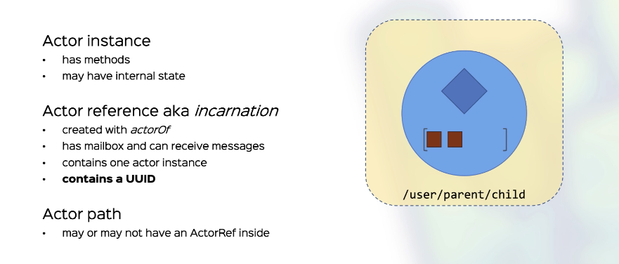
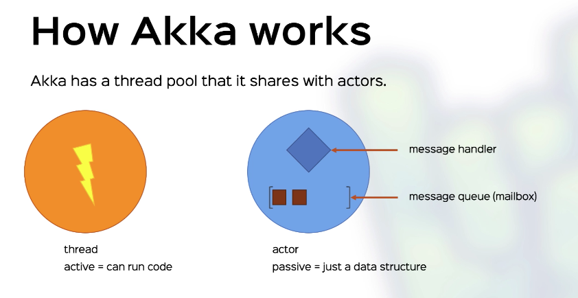
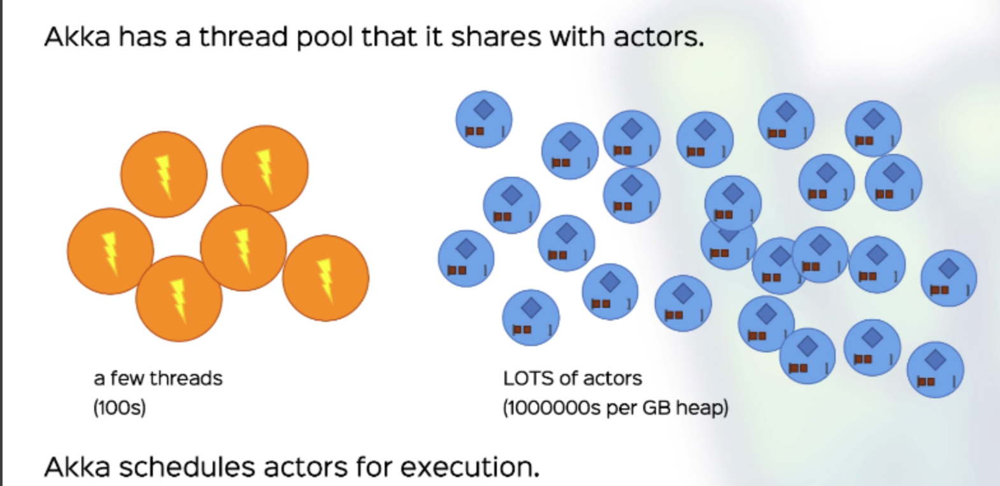

# Akka Essentials

## Actors
### Basics
With traditional objects:
- We store their state as data
- We call their methods

With actors:
- We store their state as data
- We send messages to them, asynchronously 

Actors are objects we can't access directly, but only send messages to.

Actors interaction is similar to people having conversations. 
You'd say something to someone, and the person will reply or take an action.

Some natural principles:
- Every interaction happens via sending and receiving messages
- Messages are asynchronous by nature
  - it takes time for a message to travel
  - sending and receiving may not happen at the same time
  - or even in the same context

### Actor Distinctions

### Lifecycle
Actors can be :
- **Started**: Create a new actorRef with a UUID at a given path
- **Suspend**: The actorRef will enqueue but not process more messages
- **Resume**: The actorRef will resume processing more message
- **Restart**: Suspend ->  
               Swap the actor instance ->  
                    - old instance calls preRestart  
                    - replace actor instance  
                    - new instance calls postRestart  
               Resume  
- **Stop**: Frees the actor ref within a path  
                - Calls postStop  
                - All watching actors receive Terminated(ref)  
            After stopping, another actor may be created at the same path  
                - Different UUID, different actorRef  

### Communication
Sending a message
- Message is enqueued in the actor's mailbox
- (thread-safe)

Processing a message
- A thread is scheduled to run this actor
- Messages are extracted from the mailbox, in order
- The thread invokes the handler on each message
- At this point the actor is unscheduled

### Guarantees
Only one thread operated on an actor at any time
- Actors are effectively single-threaded
- No locks needed
- Message process is atomic

Message delivery guarantees
- At most once delivery
- For any sender-receiver pair, the message order is maintained
  
## Course Details
Akka Essentials with Scala - Rock the JVM - Udemy

### Contents
- [x] 1h11min Scala and Parallel Programming recap
- [x] 3h57min Akka Actors 
- [x] 1h58min Testing Akka Actors 
- [x] 1h51min Fault Tolerance
- [x] 1h37min Akka Infrastructure
- [ ] 1h58min Akka Patterns